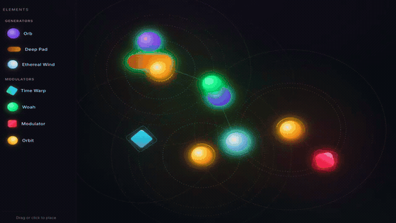

# Generative Audio Browser

**[Live demo](https://Davor111.github.io/generative-audio-browser/)**

An interactive generative audio-visual experience in the browser. Drag animated elements onto a canvas to build evolving soundscapes. Work in progress.

DISCLAIMER: This project also serves as a playground for me to test out AI workflows and (local) LLMs.



## How it works

The canvas holds two categories of element:

- **Generators** (Orb, Deep Pad, Ethereal Wind, Power Synth) — produce sound continuously on recursive `setTimeout` note-scheduling loops, walking a pentatonic scale
- **Modulators** (Time Warp, Woah, Modulator, Orbit) — silent; each has an influence radius and reshapes nearby generators in real time

Every animation frame a proximity loop (`requestAnimationFrame`) computes distances between all modulators and generators, ramps Tone.js audio parameters (`.rampTo()`), and draws connector lines on an overlay `<canvas>`.

| Element | Effect |
|---|---|
| **Orb** | Melodic sine synth, walks pentatonic notes |
| **Deep Pad** | Fat sawtooth bass with slow portamento |
| **Ethereal Wind** | Pink noise through a sweeping band-pass auto-filter |
| **Power Synth** | Mutable Instruments Plaits running as wasm in an AudioWorklet — 24 synthesis engines, right-click to pick one |
| **Time Warp** | Speeds up note scheduling of nearby generators |
| **Woah** | Feeds nearby generators into a ping-pong delay + reverb send |
| **Modulator** | Drives distortion wet mix on nearby generators (timbre/morph on a Power Synth) |
| **Orbit** | Physically rotates nearby elements around itself |

All audio routes through a shared `Limiter → Reverb` master chain. The DOM (`el.style.left` / `el.style.top`) is the source of truth for element position — there is no separate coordinate model.

## Stack

- **TypeScript** — strict mode, compiled by Vite
- **Vite** — dev server and production bundler
- **Tone.js v15** — Web Audio abstraction (oscillators, effects, scheduling)
- **WebAssembly + AudioWorklet** — the Power Synth runs the [Plaits](https://github.com/sourcebox/mi-plaits-dsp-rs) DSP compiled to wasm, on its own audio-thread processor alongside the Tone graph
- No framework, no state library

## Running locally

```bash
yarn install
yarn dev
```

Open `http://localhost:5173`, click **Start Experience**, then drag or click elements from the sidebar onto the canvas.

```bash
yarn build    # production bundle → dist/
yarn preview  # serve the dist/ build locally
```
